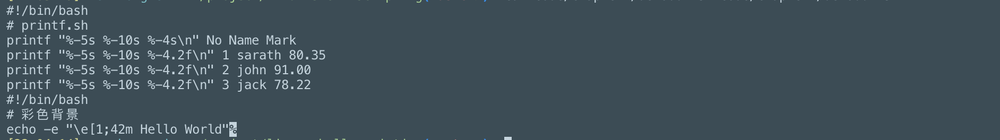
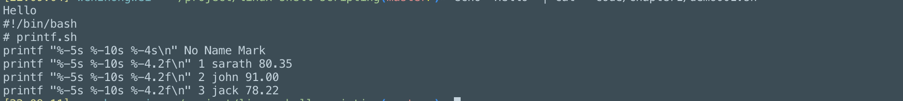

## 使用cat进行拼接
```
一般语法：
$ cat file1 file2 file3
```
1. 打印单个文件的内容
```
cat file.txt
```
2. 打印多个文件的内容
```
cat file1.txt file2.txt
```


3. 数据拼接
```
echo "Hello" | cat - code/chapter1/demo001.sh
```


4. 取出多余空白行
```
cat -s code/chapter1/demo001.sh
```
5. 识别制表符
```
cat -T code/chapter1/demo001.sh
```
6. 显示行号
```
 cat -n code/chapter1/demo001.sh
```

